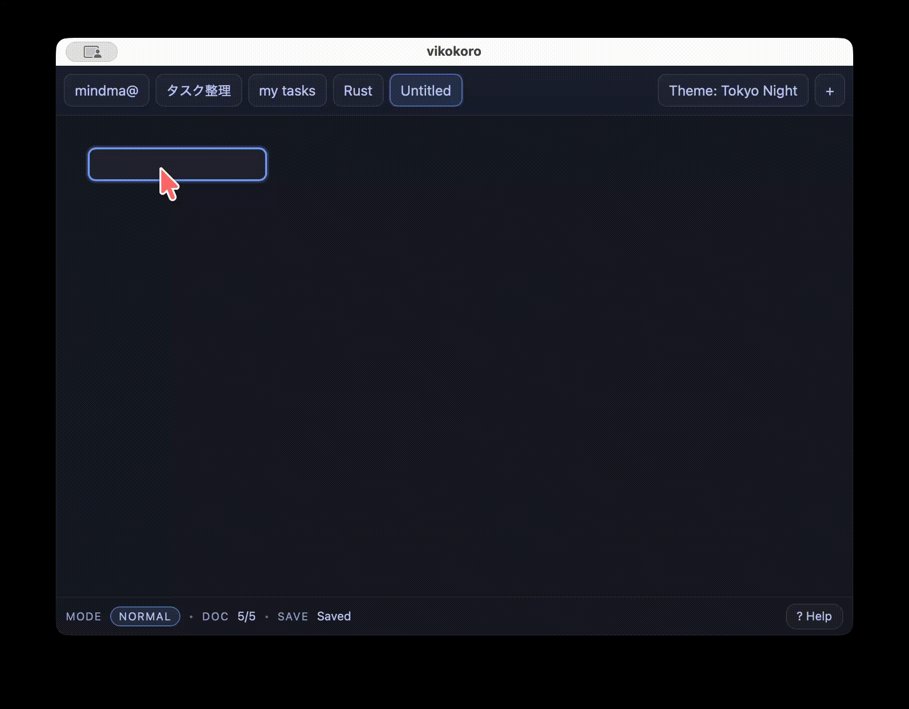

# vikokoro

English version: [README.md](README.md)

Tauri v2 + React + TypeScript で作った、キーボード中心のツリー/マインドマップ風エディタです。
Vimライクな **Normal / Insert** モードでノードの追加・移動・編集ができます。



このデモでは、ノード追加（`Tab` / `Enter`）→編集（Insert）→移動（`hjkl` + `j/k`）の基本操作をしています。

※ 現状は個人開発のため、仕様は変わる可能性があります。


## できること

- Normal / Insert のモード切り替えで編集
- `Tab` で子ノード追加、`Enter` で兄弟ノード追加（どちらも即編集）
- `h/j/k/l` でカーソル移動、`J/K` で兄弟の並び替え
- `H/L` でノードの階層移動（左/右 = outdent/indent、サブツリーごと移動）
- ノードをドラッグして自由配置、`Shift+Drag` で枝全体を移動
- `Shift+Click` / 空白ドラッグで複数選択し、一括移動
- 空白ダブルクリックで、その位置に選択ノードの子を追加
- 整列ガイドと軽い吸着、`=` / `+` で枝 / 全体を右向きに自動整列
- 親子線をクリックして、親側/子側の接続辺を手動指定（`Auto`で解除）
- `f` でヒント表示し、対応キー入力で任意ノードへジャンプ
- `F` で選択中の枝だけにフォーカスし、パンくずまたは `Esc` で全体表示へ戻る
- 枝の折りたたみ（`za` 切替、`zc` 閉じる、`zo` 開く、`zM` / `zR` 全閉 / 全開）
- `dd` で削除（ルートは保護、子は繰り上げ）
- ノード色変更（`c` で開く、`1-5` で適用、`0` で解除。`5` は完了向けグレー）
- ノード詳細メモ（`m` で開く、複数行メモ、メモありノードに `M` バッジ表示）
- Undo / Redo
- タブ（複数ドキュメント）
- 検索（`Ctrl+F`） / コマンドパレット（`Ctrl+P`） / ヘルプ（`?`）
- テーマ切替（Dark / Light / Ivory / Tokyo Night）
- ズーム（`Ctrl + Wheel`） / パン（`Space + Drag`）
- ローカル永続化（Tauri起動時のみ）
- LLM設定モーダル（`LLM`）で Gemini の provider/model/API key を設定し接続テスト
- LLM支援モーダル（`AI`）
  - `Generate`: 現在タブを生成結果で置き換え
  - `Improve`: 差分プレビューを表示し、`Apply` で反映


## 使い方（操作）

ショートカット一覧はアプリ内のヘルプが最新です。

- ヘルプ: `?`
- 閉じる: `Esc`

よく使うキー（Normal）:

- `Tab`: 子を追加して編集
- `Enter`: 兄弟を追加して編集
- `h/j/k/l`: 親/次/前/子へ移動
- `J/K`: 兄弟を下/上へ並び替え
- `H/L`: ノードを左/右へ階層移動（outdent / indent）
- `Alt+h/j/k/l`: 選択ノードを8px移動（`Shift` 併用で32px）
- `=` / `+`: 選択枝 / マップ全体を自動整列
- マウスドラッグ: 自由配置（`Shift` 併用で枝全体）
- 空白ダブルクリック: クリック位置に子ノードを追加
- 親子線クリック: 接続線を選択し、上下左右の接続点をクリック
- `f` + ヒントキー: 任意ノードへジャンプ
- `F`: 選択中の枝へフォーカス（`Esc` で全体表示）
- `za` / `zc` / `zo`: 枝の開閉切替 / 折りたたみ / 展開
- `zM` / `zR`: 表示中の枝をすべて折りたたみ / 展開
- `dd`: 削除
- `c`: ノード色メニューを開く（`1-5` 適用、`0` 解除、`Esc` 閉じる）
- `m`: ノード詳細メモを開く（`Esc` で閉じて確定）
- `u` / `Ctrl+r`: Undo / Redo

編集（Insert）:

- `i`: Insertに入る
- `Esc`: 確定してNormalへ
- `Enter`: 確定してNormalへ
  - 日本語IMEで変換中に押した場合も、変換確定後に同じEnterでNormalへ戻ります

LLM（Tauri起動時）:

- ステータスバーまたはコマンドパレットから `LLM` を開く
- `Provider` / `Model` を選び、APIキーを貼り付けて `Save`
- `Test Connection` で確認（APIクォータを消費します）
- `AI` を開いて実行
  - `Generate`: トピックから新規マップを生成
  - `Improve`: まずプレビュー、`Apply` 押下で反映


## データ保存について

Tauri起動時（`npm run tauri dev` / `npm run tauri build` で起動したアプリ）では、ワークスペースをローカルに保存します。

- 保存先: OSごとの AppData 配下の `workspace.json`
  - Tauri側で `BaseDirectory::AppData` を使用
- LLM設定の保存先: AppData 配下の `llm_settings.json`
- APIキーの保存先:
  - 優先: OSの認証情報ストレージ（keyring）
  - フォールバック: keyringが使えない環境では `llm_settings.json`
- ブラウザ起動（`npm run dev`）では `invoke` が使えないため、永続化は無効（UIは `Local` 表示）


## セットアップ（開発者向け）

### 必要なもの

- Node.js（Vite要件の都合で **20.19+ または 22.12+ 推奨**）
- Rust（stable）

IDEは VS Code + rust-analyzer + Tauri拡張が便利です。

### インストール

```sh
npm ci
```

### 起動

ブラウザで起動（永続化なし）:

```sh
npm run dev
```

Tauriで起動（永続化あり）:

```sh
npm run tauri dev
```

### ビルド

```sh
npm run tauri build
```

生成物は概ね `src-tauri/target/release/bundle/` 配下に出ます。


## GitHub Actions（macOS/Windowsビルド）

手元にビルド環境が無い端末向けに、GitHub Actionsで実行ファイルを生成できます。

- Workflow: `.github/workflows/tauri-build.yml`
- 実行方法: GitHub の `Actions` タブ → `tauri-build` → `Run workflow`
- 生成物: Actions の `Artifacts` に `vikokoro-macos-latest` / `vikokoro-windows-latest` が出ます


## トラブルシューティング

### macOSで「壊れているため開けません」と出る

未署名アプリをダウンロードした際に、Gatekeeper（quarantine属性）で弾かれることがあります。
自分の端末で動かすだけなら、次で回避できる場合があります。

```sh
xattr -dr com.apple.quarantine "/Applications/vikokoro.app"
```

（必要なら）状況確認:

```sh
spctl --assess --verbose=4 "/Applications/vikokoro.app"
```

### Node.js のバージョン警告が出る

Viteの要件により Node.js のバージョンが古いと警告が出ます。
`node -v` を確認し、必要なら `22.12+` または `20.19+` に上げてください。

### `Gemini API key is not set` が出る

- `LLM` を開いて `Stored key: Configured` になっているか確認
- `Not set` のままなら、APIキーを再入力して `Save`
- 保存後に `npm run tauri dev` を一度再起動

### `Rate limit exceeded. Retry later.` が出る

- Gemini API 側の `429` です
- 連打を避け、少し待って再試行してください
- 必要なら軽いモデルへ変更してください


## 主要ディレクトリ

- `src/`: フロントエンド（React/TS）
- `src/editor/`: エディタ本体（状態管理・レイアウト・ビュー）
- `src/hooks/`: 永続化などのhooks
- `src/ui/modals/`: Help/Search/Paletteなどのモーダル
- `src-tauri/`: Tauri（Rust）側
- `docs/`: マイルストーンや引き継ぎメモ

## コントリビューション

Issue / PR 作成前に、以下のガイドを確認してください。  
[`CONTRIBUTING.md`](CONTRIBUTING.md)


## ライセンス

MIT（`LICENSE`）
